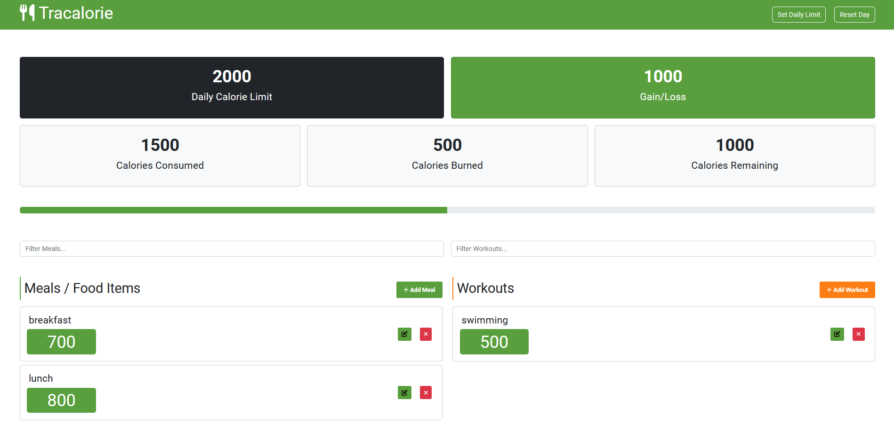

## Tracalorie App 1.0.0

The Tracalorie app tracks calories against the calorie limit.  The project is from the [Modern JavaScript from The Beginning 2.0 course](https://www.traversymedia.com/modern-javascript-2-0).

The app is setup for Production.  It is bundled using the [**webpack**](https://webpack.js.org/) module bunder for JavaScript.

An new edit feature is available!  Item or calories can be updated using the edit button.

 

---

**Tracalorie App screenshot:**

---